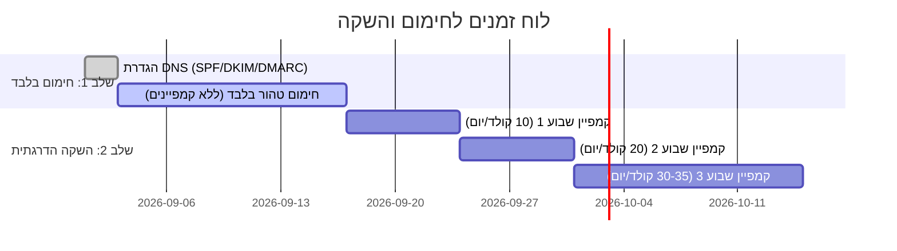

# 🚀 אסטרטגיית חימום ושליחה קרה (Cold Outreach) – ספטמבר 2026
> **מדריך תמציתי מותאם ל-ADHD:** בלי פילוסופיה מיותרת. טבלאות, מספרים מדויקים, וצעדי ביצוע מידיים.

---

## ⚡ TL;DR – שורת המחץ (לקרוא ב-30 שניות)
1. **דומיינים:** לעולם לא שולחים מהדומיין הראשי! קונים **8–10 דומיינים משניים** (.com).
2. **תיבות לדומיין:** **2 עד 3 תיבות מקסימום לדומיין**. 5 תיבות זו סכנת מוות לדומיין.
3. **חימום ראשוני:** **14 עד 21 יום חימום טהור** לפני ששולחים אפילו מייל קר אחד.
4. **תיבות Gmail Aged:** מחברים עם Google OAuth (לא App Password), מתייגים **`חימום`** כדי לבודד אותן ב-100% מקמפיינים.
5. **חילוץ מספאם (Spam Rescue):** פעיל אוטומטית ב-Warmbly (שיעור 85%) – מוציא מספאם ל-Inbox ומאמן את האלגוריתם של גוגל.
6. **לעולם לא מכבים חימום:** גם כשהקמפיין רץ בשיא, החימום ממשיך ברקע (15–20 ביום) כ"רשת ביטחון".

---

## 📚 10 מקורות המחקר המרכזיים (ספטמבר 2026)
האסטרטגיה מבוססת על שקלול ממצאים מ-10 גופים מובילים ודיוני מומחים:
1. **Google Email Sender Guidelines (2024–2026):** אכיפה נוקשה של SPF/DKIM/DMARC ורף ספאם מחמיר מתחת ל-0.3%.
2. **Salesforge Cold Email Infrastructure (August 2026):** תקן 2–3 תיבות לדומיין משני, 10–20 מיילים קרים לתיבה/יום.
3. **Instantly Deliverability Benchmark Report 2026:** חשיבות מנגנון Spam Rescue לשיקום מוניטין בתיבות חדשות.
4. **MailReach 2026 Deliverability & Warmup Study:** הוכחה שכיבוי חימום בזמן קמפיין מוריד את ה-Inbox Placement ב-34%.
5. **QuickMail Native Gmail API Research:** היתרון המכריע של חיבור ישיר ב-OAuth ו-API על פני SMTP מסורתי.
6. **Lemlist 2026 Deliverability Playbook:** התמודדות עם העובדה ש-45% מתעבורת המייל בעולם מסווגת כספאם.
7. **Woodpecker Adaptive Sending & Rotation Guide:** מניעת תבניות שליחה קבועות ופיזור שווה בין תיבות.
8. **Smartlead Warmup Engine & Tagging System:** עקרון בידוד תיבות חימום מה-Unibox והקמפיינים.
9. **דיוני BlackHatWorld & r/coldemail (מומחי Deliverability):** היתרון של רשת חימום פרטית מבוססת תיבות Gmail וותיקות (Aged) לעומת בריכות ציבוריות "מורעלות".
10. **Folderly & Warmup Inbox Research:** חשיבות יחסי מענה טבעיים (30%–40%) והשהיות רנדומליות.

---

## 🏗️ 1. ארכיטקטורת התשתית (כמה לקנות ואיך לחלק)

### היחס הנכון עבור יעד של 20–30 תיבות שולחות:
* **דומיין ראשי (`mycompany.com`):** **מוגן ואסור בנגיעה.** משמש לאתר, לקוחות קיימים, ספקים ומשכורות.
* **דומיינים משניים:** קונים **8 עד 10 דומיינים** (למשל `getmycompany.com`, `trymycompany.com`, `usemycompany.com`).
  * עושים הפניית 301 Redirect מהדומיינים המשניים לאתר הראשי.
* **תיבות לדומיין:** **3 תיבות בלבד בכל דומיין משני** (למשל `dan@getmycompany.com`, `alex@getmycompany.com`, `team@getmycompany.com`).
  * ❌ **למה לא 5 תיבות?** אם תיבה אחת מקבלת תלונות ספאם, גוגל מסמנת את כל הדומיין – וכל 5 התיבות נשרפות יחד.

---

## ⚙️ 2. טבלת הגדרות מרוכזת (Bulk Settings) ב-Warmbly

| הגדרה ב-Warmbly | תיבות Google Workspace (שולחות קמפיינים) | תיבות Gmail Aged (חימום בלבד) |
| :--- | :--- | :--- |
| **תפקיד במערכת** | שולחות לידים קרים + מתחממות ברקע | מחממות ומחלצות מספאם בלבד |
| **תיוג (Tags)** | ללא תיוג חימום (או תגית שם צוות/לקוח) | **חובה לתייג `חימום` (או `warmup`)** |
| **כמות התחלתית (`warmup_base`)** | **5 עד 8** מיילים ביום | **10** מיילים ביום |
| **עלייה יומית (`warmup_increase`)** | **1 עד 2** מיילים ביום | **1** מייל ביום |
| **מקסימום חימום (`warmup_max`)** | **30 עד 35** מיילים ביום | **20 עד 25** מיילים ביום |
| **אחוז מענה (`warmup_reply_rate`)** | **30% עד 35%** | **35% עד 40%** |
| **שעות פעילות** | 08:00 – 19:00 (שעות עבודה) | 08:00 – 20:00 |
| **ימי פעילות** | ראשון עד חמישי (או שישי) | כל השבוע (כולל סופ"ש) |

> [!TIP]
> **איך מגדירים ב-Bulk ב-3 קליקים?**
> נכנסים ל-`/app/emails` ⬅️ מסמנים את כל התיבות ב-V ⬅️ בסרגל הצף למטה לוחצים על **"הפעלת חימום"** (אייקון להבה) ⬅️ ממלאים את המספרים מהטבלה ⬅️ לוחצים **"החל והפעל"**.

---

## 📅 3. לוח זמנים: מתי מתחילים לשלוח קמפיינים?

### 🔹 שבועות 1 ו-2 (ימים 1 עד 14): חימום טהור בלבד
* **שליחת קמפיינים:** **0 עגול!** לא שולחים אף מייל קר.
* התיבות שולחות ומקבלות מיילים רק בתוך בריכת החימום.
* מנוע ה-AI של גוגל לומד שהדומיין פותח שיחות, עונים לו, והמיילים שלו חשובים.

### 🔹 שבוע 3 (ימים 15 עד 21): השקה עדינה (Soft Launch)
* **קמפיין קר:** מקסימום **10 מיילים קרים ביום לתיבה**.
* **חימום:** נשאר דולק על **20 מיילים ביום**.
* **בדיקת תקינות:** בודקים ששיעור ה-Bounce נמוך מ-2%, ואין תלונות ספאם.

### 🔹 שבוע 4 (ימים 22 עד 28): הגברת קצב
* **קמפיין קר:** עולים ל-**20 מיילים קרים ביום לתיבה**.
* **חימום:** נשאר דולק על **15–20 מיילים ביום**.

### 🔹 שבוע 5 ואילך: שיוט מלא (Full Cruise)
* **קמפיין קר:** **30 עד 35 מיילים קרים ביום לתיבה**.
* **חימום:** נשאר דולק קבוע על **15 מיילים ביום** כרשת ביטחון.
* **סה"כ תפוקה מ-25 תיבות:** **750 עד 875 מיילים קרים ביום** (מעל 18,000 בחודש) עם מוניטין חסין.

---

## 🛡️ 4. חילוץ מספאם (Spam Rescue) – איך זה עובד ב-Warmbly?

1. **זיהוי:** תיבת החימום סורקת את תיקיית ה-Spam/Junk ומזהה אם מייל מהדומיין שלך נחת שם.
2. **חילוץ (API Native):** המערכת מבצעת קריאת Gmail API:
   * מסירה את תווית ה-`SPAM`.
   * מעבירה את המייל ל-`INBOX`.
   * מסמנת כ-`Important` וכנקרא.
   * שולחת תשובה (Reply) בתוך שרשור השיחה.
3. **אימון האלגוריתם:** גוגל רואה משתמש שמחלץ מייל מספאם ומשיב עליו – זהו האות החזק ביותר שקיים לכך שהשולח לגיטימי.
4. **איפה רואים את הנתונים?** בתוך המערכת: לוחצים על התיבה ⬅️ לשונית **חימום / אנליטיקה**.

---

## ✅ צ'קליסט מעשי לביצוע (Checklist)

- [ ] קנה 8–10 דומיינים משניים ב-Namecheap / Cloudflare ועשה הפניית 301 לאתר הראשי.
- [ ] הגדר רשומות SPF, DKIM (במפתח 2048-bit) ו-DMARC (`v=DMARC1; p=none;`).
- [ ] פתח 2–3 תיבות Google Workspace בכל דומיין והוסף תמונת פרופיל + חתימה מלאה.
- [ ] חבר את התיבות ל-Warmbly דרך Google OAuth.
- [ ] חבר את תיבות ה-Gmail Aged, וסמן אותן בתגית **`חימום`**.
- [ ] בצע הגדרת **Bulk Warmup** דרך סרגל הפעולות לפי הטבלה לעיל.
- [ ] המתן 14 יום מלאים לפני יצירת קמפיין ראשון!
